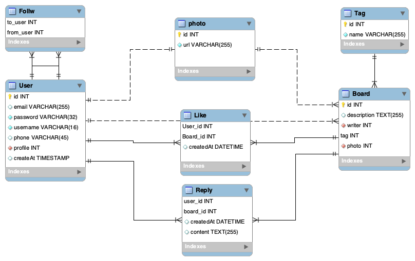

# Yeonstargram express SERVER
  
  
서버 실행  
  
  
```
  npm start
```
  
  
## 회원관련  
  
  
  
  
### [GET] /api/account  
  
  
Request  
  
  
```
 {

 }
```
  
  
Response  
  
  
```
  {
    email,
    username,
    phone 
  }
```
  
  
200 : 성공  
404 : 로그인 중이 아닏 때  
  
  
  
  
### [POST] /api/account/login  
  
  
Request  
  
  
```
  {
    email:'',
    password:''
  }
```
  
  
Response  
  
  
```
  {

  }
```
  
  
200 : 성공 - 세션처리  
  
  
  
  
### [POST] /api/account/join  
  
  
  
Request  
  
  
```
  {
    email : '',
    password : '',
    username : '',
    phone : ''
  }
```
  
  
Response  
  
  
```
  {

  }
```
  
  
200 : 성공  
400 : 이미 가입된 이메일  
  
  
  
  
### [POST] /api/account/logout  
  
  
Request  
  
  
```
 {

 }
```
  
  
Response  
  
  
```
  {

  }
```
  
  
200 : 성공 - 세션처리  
  
  
  
### DB 관계 구조  
  
  
  